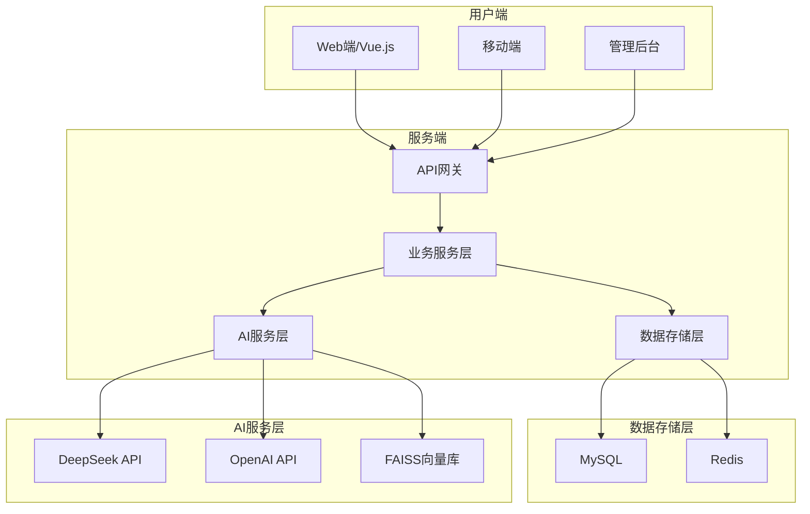

```mermaid
graph TB
    subgraph 服务端
    A[API网关] --> B[业务服务层]
    B --> C[数据存储层]
    B --> D[AI服务层]
    end
    
    subgraph 数据存储层
    C --> C1[MySQL]
    C --> C2[Redis]
    end
    
    subgraph AI服务层
    D --> D1[DeepSeek API]
    D --> D2[OpenAI API]
    D --> D3[FAISS向量库]
    end
    
    subgraph 用户端
    E[Web端/Vue.js] --> A
    F[移动端] --> A
    G[管理后台] --> A
    end
```
